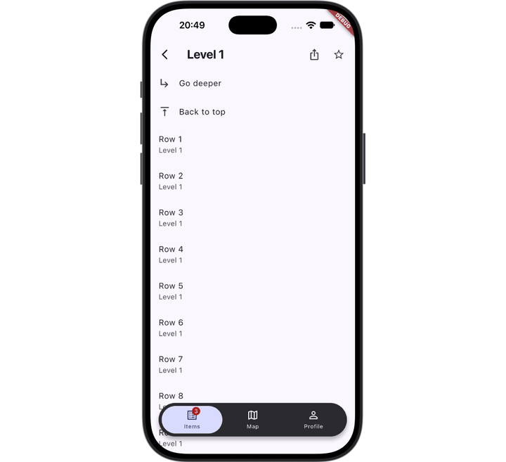

# duo_navigation

**Thumb-friendly navigation for apps that run on phones, foldables and tablets, often in one session.**



On a phone, navigation sits at the bottom, right under your thumb. Unfold the device, rotate it, or open the app in split screen, and most layouts push back buttons and actions to the top corners, out of reach while you hold a foldable or tablet in both hands.

duo_navigation keeps everything reachable. On wide screens tabs, back and page actions dock into one column along the screen edge your hand is already on, and in split screen that column follows your window to the physical screen edge. SwiftUI does this automatically on the iPhone Duo; duo_navigation brings the same behavior to Flutter. The switch happens live whenever the window changes size, without losing navigation or page state.

Adding duo_navigation to an existing app (a `Scaffold` with a tab bar, an `IndexedStack`, a `Navigator` per tab)? See [adopting duo_navigation in an existing app](doc/adopting.md). Upgrading from nav_dock 0.0.1? duo_navigation is its new name; see the [migration guide](doc/migration_0.1.md).

## What goes where

One navigation code path, two layouts:

| | Compact (phones) | Wide (tablets, unfolded foldables) |
|---|---|---|
| Tabs | bottom tab bar | vertical rail at the bottom of the side column |
| Leading (back/close) | title bar | chip right above the rail (a text one like "Cancel" stays in the title bar) |
| Trailing icon actions | title bar | chips stacked above the leading chip |
| Trailing text actions | title bar | stay in the title bar, on the column's side |
| Modal pages | no tab bar | side column with actions, no rail |
| The page itself | above the tab bar | beside the column |

The package owns **placement, insets, visibility, identity, semantics and animation timing**. Every visual (tab items, tab bar, rail, chips, title bar, column arrangement, transitions) is a builder you can replace.

## Platforms and installation

Every Flutter platform, Flutter 3.35 or later; `duo_navigation` has no native code.

```sh
flutter pub add duo_navigation
flutter pub add duo_navigation_window_placement   # optional: follow the window to the screen edge in split screen (iOS, iPadOS, Android)
```

## Quick start

```dart
import 'package:duo_navigation/material.dart'; // duo_navigation and its Material visuals

MaterialApp(
  // Above the root Navigator, so root-level modals see it too.
  builder: (context, child) => DuoNavigation(
    builders: const DuoMaterialBuilders(),
    data: const DuoNavigationData(
      // The default: wide when the window's shorter side is at least 600, so
      // phones keep the bottom bar in landscape. breakpoint(600) uses the width.
      layoutPolicy: DuoLayoutPolicy.shortestSide(600),
    ),
    child: child!,
  ),
  home: const Home(),
);

// The tabs: one Navigator per tab, the inactive ones kept alive and inert.
DuoShell(
  tabs: const [
    DuoTab(id: 'items', icon: DuoIcon(Icons.list_alt), label: 'Items', badge: DuoBadge.count(3)),
    DuoTab(id: 'profile', icon: DuoIcon(Icons.person), label: 'Profile'),
  ],
  currentIndex: index,
  onTabSelected: (i) => setState(() => index = i),
  child: DuoTabStack(index: index, children: [itemsNavigator, profileNavigator]),
);

// A page: declare its actions once.
DuoPage(
  title: const Text('Level 2'),
  trailing: [
    DuoAction(id: 'share', icon: const DuoIcon(Icons.ios_share), onPressed: share),
    DuoAction(id: 'done', label: 'Done', onPressed: done), // text: stays in the title bar
  ],
  body: const Details(),
);
```

## Adoption levels

Each level works without the ones above it, so an app can adopt duo_navigation step by step ([the guide](doc/adopting.md) walks through it):

| Level | Use | Works with |
|---|---|---|
| 0 | `DuoNavigation.modeOf` / `sideOf`, `DuoGeometry` (`package:duo_navigation/geometry.dart`) | your own frame and pages |
| 1 | `DuoShell` and tabs (`DuoTabStack`) | plain `Scaffold` pages with their own `AppBar`; the column holds only the rail |
| 2 | `DuoPage` / `DuoPageScope` and actions | actions moving into the column, or not (`DuoHoisting.none`) |
| 3 | custom builders, typed payloads, backdrops, bleed | your design system |

Pages, shells and modal frames need a `DuoNavigation` above them and fail loudly without one. Where a migrated page can also be shown outside the migrated part of the app (a route pushed by a plugin or a second `MaterialApp`), wrap it in `DuoStandalone(builders: const DuoMaterialBuilders(), child: page)`: it provides a compact `DuoNavigation` there, and does nothing below the app's own.

## Tabs

A `DuoTab` has an `id` (`find.byKey(DuoKeys.tab(id))` finds it), icons as `DuoIcon` descriptors (`DuoIcon(Icons.x)`, `.image`, `.widget`), and optionally a `badge` (`DuoBadge.count`, `.text`, `.dot`), `tooltip`, `semanticLabel`, `key` and a typed `payload` for custom builders.

```dart
DuoShell(
  tabs: tabs,
  currentIndex: index,
  onTabSelected: (i) => setState(() => index = i),
  onTabReselected: (i) => navigatorKeys[i].currentState?.popUntil((r) => r.isFirst),
  canSelectTab: (i) async => !hasUnsavedChanges, // optional veto, sync or async
  child: DuoTabStack(
    index: index,
    children: [
      for (final (i, root) in roots.indexed)
        DuoTabNavigator(
          navigatorKey: navigatorKeys[i],
          onGenerateRoute: (_) => MaterialPageRoute(builder: (_) => root),
        ),
    ],
  ),
)
```

`DuoTabStack` keeps every tab alive and the inactive ones inert: offstage, not ticking, out of focus, semantics and hero flights. `maintainTickers: true` keeps inactive tabs ticking (a video, a map camera), as an `IndexedStack` does; their pages still don't claim the column. Any other container works too, as long as inactive tabs are under `TickerMode(enabled: false)` (so their pages don't claim the column). When the rail doesn't fit the column, it scrolls and keeps the selected tab visible.

`DuoTabNavigator` is a `Navigator` for a tab: Android's system back pops the shown tab's pages before it leaves the app, a hidden tab's pages don't keep the app from closing, and it doesn't clip, so a `DuoBleed` reaches under the chrome.

Coming from `IndexedStack`: it builds every tab at once (`DuoTabStack(lazy: false)` does too), keeps inactive tabs ticking (`maintainTickers`) and lets their heroes fly; inactive pages there claim the column unless wrapped in `TickerMode(enabled: false)`.

**go_router.** `StatefulShellRoute.indexedStack` provides exactly that:

```dart
StatefulShellRoute.indexedStack(
  builder: (context, state, shell) => DuoShell(
    tabs: tabs,
    currentIndex: shell.currentIndex,
    onTabSelected: (i) => shell.goBranch(i, initialLocation: i == shell.currentIndex),
    child: shell,
  ),
  branches: [...],
);

// Modal routes: put them on the root navigator.
GoRoute(
  path: 'edit',
  parentNavigatorKey: rootNavigatorKey,
  pageBuilder: (context, state) => const MaterialPage(fullscreenDialog: true, child: EditProfilePage()),
);
```

`example/lib/main_go_router.dart` is a complete app.

## Pages and actions

**The leading action is implied**: back for pushed pages, close for `fullscreenDialog`. `impliedLeading: DuoImpliedLeading.close` on a `DuoModalScope` or a page asks for close on any other route (a custom modal route, a sheet-like page). Pass `leading` to change it, for example a text-only `DuoAction.back(icon: null, label: 'Cancel')`, which stays in the title bar in every mode. `leadingAtEnd: true` puts the leading action at the end of the title bar, after the other actions: the close button at the top right of an iOS-style sheet. In wide mode it is still the lowest chip in the column. For every modal at once, `DuoNavigationData(modalLeading: DuoModalLeading(implied: DuoImpliedLeading.close, atEnd: true))` applies both to each modal start (a `DuoModalScope`'s first page, a full-screen dialog, a sheet; not a plain page pushed on the root navigator); a `DuoModalScope` or a page overrides it.

**An action** has an `id` (`find.byKey(DuoKeys.action(id))` finds it), an icon as `DuoIcon` (`DuoIcon.back` and `DuoIcon.close` follow the platform) and/or a `label`, and optionally:

| Field | |
|---|---|
| `role` | `back`, `close`, `primary`, `secondary`, `destructive`, `overflow`; builders style by it |
| `enabled`, `badge`, `tooltip`, `semanticLabel`, `key` | |
| `order` | position in the column: higher sits higher; the leading action is always lowest |
| `hoist: DuoHoist.never` | stays in the title bar in wide mode |
| `cooldown`, `guarded` | tap guard per action (see below) |
| `payload` | typed app data for custom builders |

**Pages with their own `Scaffold`.** `DuoPage` is two pieces: `DuoPageScope` (title, actions and bar payload, registered with the frame) and the `page` builder. Use the scope directly to keep your own `Scaffold`, keys, bottom bar or floating action button, and read the bar with `DuoAppBar` or `DuoBarData.of(context)`:

```dart
DuoPageScope(
  title: const Text('Items'),
  trailing: [DuoAction(id: 'add', icon: const DuoIcon(Icons.add), onPressed: add)],
  child: Scaffold(
    key: const Key('items'),
    appBar: const DuoAppBar(),
    bottomNavigationBar: const ItemsToolbar(),
    body: const ItemsList(),
  ),
)
```

`DuoPage.custom(builder: (context, bar) => ...)` builds the whole page from `DuoBarData` (slivers, large titles, floating bars). `DuoBarLayout` lays out a custom bar's leading action, title and actions, with the actions following the column to the start edge (`bar.trailingAtStart`), the leading action at the end (`bar.leadingAtEnd`), right-to-left and a centered title. `DuoAppBar` passes `AppBar`'s colors, elevation, shape, `systemOverlayStyle`, `titleTextStyle`, `flexibleSpace` and `bottom` through. `barPayload` passes page data to the bar builder, typed (`bar.payload`).

**Keeping actions in the bar.** `DuoHoisting.none` (on `DuoNavigationData`, `DuoShell`, `DuoModalScope` or a page) moves nothing into the column: every page keeps all its actions, back included, in its title bar, and the bar data is the same in both modes.

**Which page owns the column.** Each page registers with the nearest frame (shell or modal). It counts as shown while its route is current, or only dialogs, sheets or menus are above it, and while its subtree is ticking; the most recently shown one owns the column. No router coupling. A dialog over a page leaves its chips in place; their taps wait until it closes.

**Action identity and animation.** Back and close (and any action with `shared: true`) are matched by `id` across pages: the chip keeps its place going four levels deep and back, and back ↔ close morphs. Every other action belongs to its page and animates out while the next page's animate in. The column is anchored to the bottom with back lowest, so the most-used chip never moves; leaving chips fade out where they were, without taking taps.

**Tap guard.** An action fires only when its page is the one shown, its route isn't in a transition or a back swipe, and the same action hasn't fired within its cooldown (350 ms). Tapping back three times pops one page; different actions don't block each other. `DuoNavigationData(tapGuard: DuoTapGuard(cooldown: ..., onRejected: (action, reason) => ...))` configures it; per action, `cooldown` overrides it and `guarded: false` opts out.

## Layout

### The body sits beside the chrome

By default (`DuoBodyMode.inset`) the frame lays the body out in the free area: beside the column in wide mode, above the tab bar in compact mode. A plain `Scaffold` page works unchanged, and a button at the bottom of a `Column` never ends up under the tab bar.

* Below the frame, `MediaQuery.padding` is zero on the edges the chrome covers and unchanged on the others.
* On its edge, the column sits at the window edge, over the system inset (`DuoColumnInset.overlap`, the default). With `DuoNavigationData(columnInset: DuoColumnInset.safeArea)` it sits after the inset instead, and its builder can paint a background under it. The trade-off shows on phones in landscape:

  | | `overlap` (default) | `safeArea` |
  |---|---|---|
  | Column | at the window edge | moved inward by the system inset |
  | Next to a camera cutout | chips can sit under it | clear |
  | Next to Android's button bar (3-button navigation in landscape) | chips can sit under the buttons | clear |
  | iPhone in landscape | at the edge on both sides | about 59 pt inward on **both** sides, because iOS reports the inset on both sides, not only on the camera's |

  This only matters where the column meets a side inset. With the default layout policy (`DuoLayoutPolicy.shortestSide(600)`) phones keep the bottom bar in landscape, and on tablets and foldables the side insets are usually zero, so both behave the same. Apps that give phones the column in landscape (`DuoLayoutPolicy.breakpoint(600)`) choose by what's on the column's edge.
* The tab bar builder owns the bottom safe area (home indicator): include `MediaQuery.paddingOf(context).bottom` in its height. A debug error reports a bar that is shorter. The bar sees no top padding, so a bar that wraps itself in `SafeArea` doesn't grow by the status bar.
* `MediaQuery.size` stays the window size, as with Flutter's own sub-screens; use `LayoutBuilder` for the available size.

`DuoGeometry.of(context)` tells a page the frame's layout: mode, side, how much the chrome covers per edge, visibility and keyboard. Pass an `aspect` to rebuild only when that part changes.

`DuoBodyMode.overlay` (on `DuoNavigationData`, `DuoShell` or `DuoModalScope`) lays the body out under the chrome instead, as nav_dock 0.0.1 did: the chrome is published as extra `MediaQuery.padding`, so `SafeArea` content stops beside it and everything else runs underneath.

### Content under the chrome

* **A backdrop** for the whole frame: `DuoShell(backdrop: ...)` (and `DuoModalScope`) paints one widget across the window, under the body, the bar and the column. A page's own `backdrop` replaces it while the page is shown, cross-fading. It covers background gradients and pictures, and no clip can cut it. Without one, the frame paints the builders' default `backdrop` (Material: the theme's scaffold background). The body stops beside the chrome, so this is what shows around a floating bar or round chips. A fully custom `DuoBuilders` without a `backdrop` leaves that strip unpainted.
* **A bleed** for single components: `DuoBleed(child: ...)` widens its child toward the column and the bar while keeping its own size, so a hero image, a carousel or a map runs to the window edge and its siblings stay beside the chrome. Inside it, `MediaQuery.padding` covers the strip, so `SafeArea` and list padding keep text clear; `DuoInset` does the same for one child. `DuoBleed.insetOf(context)` returns the strip for painters and custom layouts.
* **A bleeding list**: wrap the scroll view, not an item in it, and mark what bleeds:

```dart
DuoBleed(
  child: ListView(
    children: DuoInset.wrapAll([
      DuoBleedItem(child: Image.asset('hero.webp', fit: BoxFit.cover)), // runs to the edge
      const ListTile(title: Text('Details')),                           // stays beside the column
    ]),
  ),
)
```

What clips a bleed: `ClipRect` and other clips, scroll views around it, and a `Navigator` (give it `clipBehavior: Clip.none`; `DuoTabNavigator` has it). `Stack`, `IndexedStack` and `DuoTabStack` don't. In debug mode a message names the first clipping ancestor. Taps in the strip go to the chrome, so keep interactive content in a `DuoInset`.

### The software keyboard

```dart
DuoNavigationData(
  keyboard: DuoKeyboard(
    column: DuoKeyboardBehavior.lift,  // default: the column fits above the keyboard
    bar: DuoKeyboardBehavior.ignore,   // default: the tab bar is covered
    body: DuoBodyKeyboardBehavior.passThrough, // default: the page's Scaffold decides
  ),
)
```

`lift` keeps the rail and the page's actions (save, done, back) reachable while typing; `hide` hides the column or bar while the keyboard is open; `ignore` leaves it covered. When space is short, the column keeps the rail and the bottom actions and scrolls the rest. If an ancestor already made room for the keyboard, nothing moves twice.

The body is the page's business by default (`passThrough`): it keeps its height, and its `MediaQuery` reports the part of the keyboard that the bar doesn't already cover, so a `Scaffold` resizes for it, or doesn't with `resizeToAvoidBottomInset: false`, as without duo_navigation. `DuoBodyKeyboardBehavior.lift` makes the frame lay every body out above the keyboard instead, for bodies that don't handle it themselves. `DuoShell(keyboard: ...)` and `DuoModalScope(keyboard: ...)` set it per frame.

### Hiding the navigation

`DuoShell(navigationVisible: false)` (and `DuoModalScope`) hides the tab bar or column with an animation, for a camera, video, onboarding or reading. A page can ask for it while it is on top: `DuoPage(visible: false)`. Hidden chrome takes no space, no taps, no focus and isn't in the semantics tree; showing it again keeps the page's state.

### Following the window to the screen edge

Only matters when your app doesn't fill the whole display: iPad Split View / Stage Manager, Android split screen or freeform windows. If your app is the left half of a split screen and the column sits on the right, it ends up in the middle of the display, next to the other app. It should sit on the left, where your window meets the physical screen edge:

```
 ┌──────────────── display ────────────────┐
 │┌───── your app ─────┐┌──── other app ───┐│
 ││▐█                  ││                  ││   ▐█ = side column
 ││▐█    content       ││                  ││   moved to the left: only the
 ││▐█                  ││                  ││   window's left edge touches
 │└────────────────────┘└──────────────────┘│   the display
 └──────────────────────────────────────────┘
```

Give `DuoNavigation` a window-edge source; `duo_navigation_window_placement` asks the [window_placement](https://github.com/JanMichaelPeter/window_placement) plugin and keeps listening:

```dart
final windowEdges = WindowPlacementEdgesSource(); // create once, dispose with the app

DuoNavigationData(windowEdgesSource: windowEdges)
```

`side` (default `DuoSide.end`) is a preference; the column only moves to the other edge when the window touches *only* that edge:

| Window touches | Typical case | Column on |
|---|---|---|
| left and right | fullscreen | `side` |
| neither | floating window | `side` |
| only the `side` edge | split screen, that half | `side` |
| only the other edge | split screen, other half | the other edge |
| unknown, or no source | | `side` |

Title-bar actions follow the column (`DuoBarData.trailingAtStart`, handled by `DuoAppBar` and `DuoBarLayout`). `DuoWindowEdgesSource` is a small interface (`value` and a `changes` stream), so an app that knows its window geometry another way can implement it; `DuoWindowEdgesSource.fixed(...)` pins the edges.

## Accessibility

* **Semantics are the package's.** Every tab item gets the tab role, its selected state, its label, the badge as value, its position ("Tab 2 of 3") and a tap action; every action is a button with its label, enabled state, badge and tap action. The package replaces whatever semantics a builder draws, so custom builders can't drop them by mistake. `DuoSemantics.tab` and `DuoSemantics.action` build the same nodes for items you draw yourself.
* **Localized strings** come from the builders (`DuoBuilders.tabPosition`, `DuoBuilders.actionLabel`); `DuoMaterialBuilders` uses `MaterialLocalizations`.
* **Order.** Focus traversal and the semantics order are the same in both modes: the page first, then the column's actions and the rail, or the tab bar.
* **Layout switches keep focus**: from a rail tab to the same tab in the bar, from a column chip to the same action in the title bar, and back.
* **Reduced motion** (`MediaQuery.disableAnimations`) turns the package's animations off.
* The Material defaults meet the Android tap-target (48 dp) and labeled-tap-target guidelines in both modes, and the column grows with the text scale (up to `columnTextScaleLimit`).

## Customizing

Every visual is a builder in `DuoBuilders`. `const DuoMaterialBuilders()` (`package:duo_navigation/material.dart`) sets all of them to Material 3 defaults that your theme styles; replace single ones with `merge`:

```dart
DuoNavigation(
  builders: const DuoMaterialBuilders().merge(DuoBuilders(
    tabItem: (context, item) => MyTabItem(...),           // one tab, bar or rail
    tabBar: (context, tabs, items) => MyBottomBar(items), // arranges the items
    rail: (context, tabs, items) => MyPillRail(items),
    action: (context, action, placement) => ...,          // title bar or column chip
    page: (context, bar, body) => MyScaffold(...),        // a DuoPage's scaffold
    sideColumn: (context, actions, rail, hasActions) => ..., // column arrangement
    actionTransition: (context, animation, child) => ...,
    backdrop: (context) => ColoredBox(color: myBackground), // behind the chrome
  )),
  data: const DuoNavigationData(
    sideColumnWidth: 76,
    sideItemExtent: 56, // rail and chip width; read it in custom builders
    side: DuoSide.end, // start for left-handed layouts
  ),
  child: child!,
)
```

* **Per shell or subtree.** `DuoShell(builders: ...)`, `DuoModalScope(builders: ...)` and `DuoBuildersScope` override the builders above them, field by field. Builders run below the shell, so inherited widgets placed around a `DuoShell` reach them.
* **Contracts.** Each builder typedef documents what it gets and what it owns: constraints, safe area, keys (the package applies `DuoKeys`), semantics and animation. Tab containers mark themselves with `DuoTabBarSemantics` (Material's `NavigationBar` does it itself); custom `sideColumn` builders can use `DuoSideColumnLayout`. A builder that no scope sets fails with an error naming it.
* **Typed payloads.** `DuoShell<MyTab, MyAction, MyBar>` with `DuoBuilders<MyTab, MyAction, MyBar>` gives the builders `DuoTab<MyTab>`, `DuoAction<MyAction>` and `DuoBarData<MyAction, MyBar>`, so they read `payload` without a cast. Builders written for `Object?`, such as `DuoMaterialBuilders`, work for any payload types; builders for other types fail with an error naming the field.
* `DuoMaterial.*` are the plain functions behind the defaults; wrap them instead of rewriting.
* **Icons.** `DuoIconMorph(icon:, builder:)` cross-fades an action's icon when it changes (back → close) with your own icon rendering; `DuoMaterial.morphingIcon` is it with Material icons.
* **Bars built from data.** A bar that builds its own children from `tabs.tabs` wraps each with `tabs.wrap(i, child)` (the package's keys and semantics) and taps through `tabs.itemData(i).onTap`. A bar that builds its item widgets itself passes `tabs.itemData(i).semanticsOf(context)` to its per-item semantics hook instead.

`example/` uses a fully custom look (`example/lib/style/custom_style.dart`): a capsule tab bar, one tab item for bar and rail, square chips, its own column layout and chip transition.

## Testing

`package:duo_navigation/testing.dart` has what widget tests need, without adding a dependency:

```dart
import 'package:duo_navigation/testing.dart';

final edges = FakeWindowEdgesSource();
await tester.pumpWidget(MaterialApp(
  builder: (context, child) => DuoTestHarness(
    builders: const DuoMaterialBuilders(),
    mode: DuoLayoutMode.wide,          // whatever the test surface size
    side: DuoSide.start,
    textDirection: TextDirection.rtl,
    windowEdgesSource: edges,           // or windowEdges: DuoWindowEdges(...)
    child: child!,
  ),
  home: const MyShell(),
));

edges.push(const DuoWindowEdges(left: true, right: false)); // split screen
await tester.tap(find.byKey(DuoKeys.action('share')));
```

`DuoTestHarness` replaces `DuoNavigation` in a test (also for pages that use `DuoStandalone`: below the harness it does nothing). Its tap guard follows the frames, so `tester.pump(duration)` lets the cooldown pass and tests never wait on real time (`DuoTapGuard.disabled` turns it off, `FakeDuoClock` controls it directly). Outside the harness the default clock (`DuoClock.system()`) follows the test's time too, so pages under a plain `DuoNavigation` or a `DuoStandalone` can be tapped twice with `pumpAndSettle` in between. `DuoKeys.bar`, `.column`, `.rail`, `.tab(id)` and `.action(id)` find the chrome whatever builder draws it.

## Libraries and API stability

| Import | Contents |
|---|---|
| `package:duo_navigation/duo_navigation.dart` | everything an app needs: configuration, shell, tabs, pages, actions, builders, keys, semantics; includes `geometry.dart` |
| `package:duo_navigation/geometry.dart` | read-only layout: `DuoGeometry`, layout mode, side, body mode, window edges and their source, layout policy, and `DuoBleed` / `DuoInset` / `DuoBleedItem`; no page, action or builder types |
| `package:duo_navigation/material.dart` | the Material visuals (`DuoMaterialBuilders`, `DuoMaterial`, `DuoAppBar`), and everything in `duo_navigation.dart` |
| `package:duo_navigation/testing.dart` | `DuoTestHarness`, `FakeWindowEdgesSource`, `FakeDuoClock`, `DuoKeys` |
| `package:duo_navigation_window_placement` | `WindowPlacementEdgesSource` (separate package with the native plugin) |

Everything these libraries export is public API and follows semantic versioning; nothing under `lib/src` is. Before 1.0, minor versions may break (and the changelog marks it); from 1.0 on, breaking changes come with a major version and deprecations last at least one minor release.

## Rules and limits

* Modal = pushed on the **root** navigator. A page pushed onto a tab navigator is a subpage and keeps the tab bar.
* Multi-step modals: wrap the modal's own `Navigator` in `DuoModalScope` so all steps share one column. Its first page gets a leading action that dismisses the whole modal (close for a full-screen dialog, or what `DuoModalScope.impliedLeading` says); the later steps get back.
* Trailing ids must be unique per page.
* Android back with nested tab navigators: add `NavigatorPopHandler` (go_router handles this).
* During an interactive iOS back swipe the column switches when the pop commits, not during the drag; page backdrops cross-fade then too.
